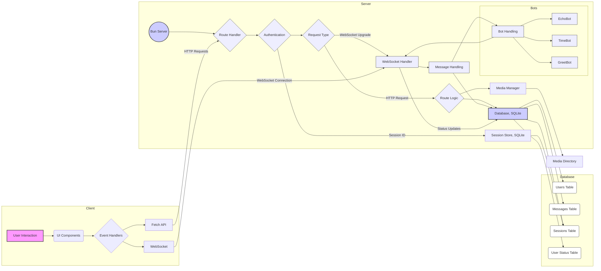

# Chatter


[](https://github.com/The-Best-Codes/chatter/blob/main/LICENSE)
[](https://github.com/The-Best-Codes/chatter/stargazers)
[](https://github.com/The-Best-Codes/chatter/issues)

A real-time chat application built with **Bun**, **WebSocket**, **SQLite**, and **Tailwind CSS**.

## Table of Contents

1.  [Features](#features)
2.  [Installation](#installation)
    - [Pre-built Executables](#pre-built-executables)
      - [Windows](#windows)
      - [macOS (Darwin)](#macos-darwin)
      - [Linux](#linux)
    - [Development Setup](#development-setup)
3.  [Daytona - Recommended Development](#daytona---recommended-development)
4.  [Development Server](#development-server)
5.  [Production Build and Deployment](#production-build-and-deployment)
6.  [Project Structure](#project-structure)
7.  [Technologies](#technologies)
8.  [Environment Variables](#environment-variables)
9.  [Attributions](#attributions)
10. [Mermaid Diagrams](#mermaid-diagrams)

## Features

- 🔐 User authentication (signup/login)
- 💬 Real-time messaging with WebSocket
- ✍️ Markdown support for messages
- 📝 Typing indicators
- 🌓 Dark mode support
- 🔄 Auto-scroll with smart scroll lock
- 📱 Responsive design

## Installation

### Pre-built Executables

If you just want to use Chatter without setting up a development environment, you can download pre-built executables from the [Releases](https://github.com/The-Best-Codes/chatter/releases/latest) page.

> [!IMPORTANT]
> Choose the correct executable for your operating system and CPU architecture (`modern` for newer CPUs, `base` for older ones).

#### Windows

1.  Download `windows-modern.zip` (or `windows-base.zip`).
2.  Right-click and extract the ZIP file.
3.  Double-click the executable to start (or run from the command line with `./chatter.exe`).
4.  Open `http://localhost:5177` in your browser.

#### macOS (Darwin)

1.  Download `darwin-modern.zip` (or `darwin-base.zip`).
2.  Extract the ZIP file.
3.  Make the file executable and run it:
    ```bash
    chmod +x ./chatter && ./chatter
    ```
4.  Open `http://localhost:5177` in your browser.

#### Linux

1.  Download `linux-modern.tar.xz` (or `linux-base.tar.xz`).
2.  Extract the archive.
3.  Make the file executable and run it:
    ```bash
    chmod +x ./chatter && ./chatter
    ```
4.  Open `http://localhost:5177` in your browser.

### Development Setup

If you want to contribute or modify the application, follow these steps:

> [!NOTE]
> It's highly recommended to use Daytona for development. This setup is described in detail in the next section.

1.  **Prerequisites:** Ensure you have [Bun](https://bun.sh) v1.1.36 or higher installed.
2.  **Clone the Repository:**
    ```bash
    git clone https://github.com/The-Best-Codes/chatter.git
    cd chatter
    ```
3.  **Install Dependencies:**
    ```bash
    bun install
    ```

## Daytona - Recommended Development

> [!TIP]
> Daytona is the easiest, fastest, and most isolated way to set up your development environment for Chatter. It creates a containerized workspace that includes all the necessary tools and dependencies.

1.  **Install Daytona**: Follow the [Daytona installation guide](https://www.daytona.io/docs/installation/installation/).
2.  **Create the Workspace**:
    ```bash
    daytona create https://github.com/The-Best-Codes/chatter
    ```
3.  **Navigate to the Workspace**:
    ```bash
    daytona open chatter
    ```
4.  **Start the Application**:
    ```bash
    bun run dev
    ```

> [!NOTE]
> When using Daytona, you can skip the steps in the "Development Setup" section.

## Development Server

> [!TIP]
> If you are not using Daytona, follow this steps to start the development server.

Start the development server with auto-reload:

```bash
bun run dev
```

Watch and compile CSS:

```bash
bun run css:watch
```

## Production Build and Deployment

### Building for Production

To prepare the application for production, run:

```bash
bun run build
```

### Starting the Production Server

Start the production server:

```bash
bun run start
```

### PM2 Deployment

The project includes PM2 scripts for production deployment:

```bash
bun run pm2-start    # Start with PM2
bun run pm2-stop     # Stop PM2 service
bun run pm2-restart  # Restart PM2 service
bun run pm2-startup  # Configure PM2 startup on boot
```

> [!CAUTION]
> Make sure to configure your production environment variables correctly when deploying with PM2.

## Project Structure

- `/src`
  - `/db` - Database schema and operations
  - `/views` - HTML templates
- `/public`
  - `/css` - Stylesheets (TailwindCSS)
  - `/pages` - Client-side JavaScript
  - `/images` - Static assets

## Technologies

- **Runtime**: [Bun](https://bun.sh)
- **Database**: SQLite
- **Styling**: TailwindCSS with Typography plugin
- **Frontend**: Vanilla JavaScript with WebSocket
- **Security**: bcryptjs for password hashing

## Environment Variables

- `PORT` - Server port (default: 5177)
- `SCHEMA_PATH` - Path to SQLite schema file

## Attributions

- [Bun](https://bun.sh)
- [TailwindCSS](https://tailwindcss.com/)
- [Markdown Renderer](https://marked.js.org/)
- [Chat Sound Effect by Universfield | 'New Notification #7'](https://pixabay.com/collections/interface-sounds-23710620/)

## Mermaid Diagrams


